# Near Real-Time E-Commerce Analytics Pipeline

> End-to-end data engineering pipeline with **Kafka · Spark · Airflow · dbt · PostgreSQL · Streamlit · Docker**
> 
> Live order events enriched with real-time weather data (OpenWeatherMap API) and country metadata (RestCountries API), streamed through Kafka, orchestrated by Airflow, transformed by dbt, aggregated by Spark, and visualized on a live dashboard.

[](https://github.com/mikailtipi/near-real-time-ecommerce-project/actions)

---

## Architecture

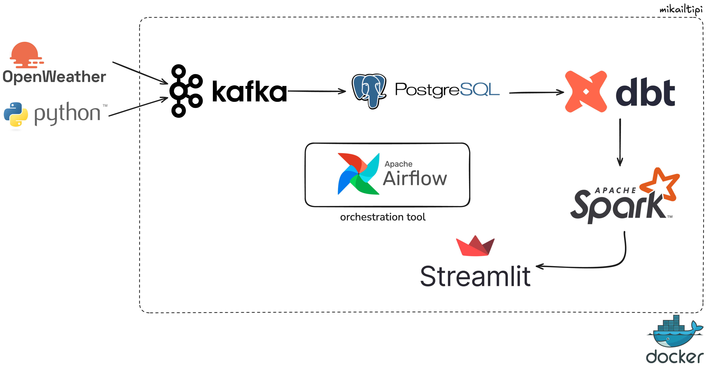

```
┌─────────────────────────────────────────────────────────────────────────────┐
│                                                                             │
│   OpenWeatherMap API ──┐                                                    │
│   RestCountries API  ──┤──▶  Kafka Producer  ──▶  Kafka (orders-raw)       │
│   Faker (orders)     ──┘                               │                   │
│                                                        ▼                   │
│                                               Kafka Consumer               │
│                                                        │                   │
│                                                        ▼                   │
│                                          PostgreSQL  raw schema             │
│                                        (orders, customers, products)        │
│                                                        │                   │
│                                          ┌─────────────┼─────────────┐     │
│                                          ▼             ▼             ▼     │
│                                     DQ Checker     Airflow DAG    Spark    │
│                                     (21 checks)    (daily 06:00)   Job     │
│                                          │             │             │     │
│                                          ▼             ▼             ▼     │
│                                    dq_results      dbt Core    spark_      │
│                                                  stg → marts   metrics     │
│                                                        │                   │
│                                                        ▼                   │
│                                            Streamlit Dashboard             │
│                                     (auto-refresh · city map · weather)    │
│                                                                             │
└─────────────────────────────────────────────────────────────────────────────┘
```

---

## Key Features

- **Near real-time streaming** — Kafka producer emits 1 order/sec with live weather data
- **External API enrichment** — Every order enriched with OpenWeatherMap (temperature, humidity, weather condition) and RestCountries (currency, population, region) data
- **Weather correlation analysis** — Dashboard shows how weather conditions correlate with order volume
- **City-level map** — Live Plotly scatter map showing order density across 12 European + Turkish cities
- **Automated orchestration** — Airflow DAG runs daily: ingest → DQ check → dbt transform → dbt test
- **Data quality monitoring** — 21 automated checks across all raw tables, results stored for trend analysis
- **Dual transformation layer** — Both dbt (SQL) and PySpark used for mart-level aggregations
- **Schema validation** — Confluent Schema Registry enforces Avro schemas on `orders-raw` topic — malformed messages are rejected before reaching the database
- **CI/CD pipeline** — GitHub Actions runs full dbt test suite on every push

---

## Tech Stack

| Layer | Tool | Purpose |
|---|---|---|
| Streaming | Apache Kafka 7.6 | Event queue for order events |
| Schema Validation | Confluent Schema Registry 7.6 | Avro schema enforcement on Kafka topics |
| Orchestration | Apache Airflow 2.9 | Daily pipeline scheduling |
| Transformation | dbt Core 1.8 | SQL-based data modeling |
| Processing | Apache Spark 3.5 | Distributed metric aggregation |
| Storage | PostgreSQL 15 | Raw / staging / marts data |
| Dashboard | Streamlit + Plotly | Live visualization |
| Containerization | Docker Compose | All services in containers |
| CI/CD | GitHub Actions | Automated dbt testing |
| External APIs | OpenWeatherMap, RestCountries | Real-time data enrichment |
| Data Generation | Python + Faker | Simulated order events |

---

## Medallion Architecture

This project follows the **Medallion Architecture** (Bronze → Silver → Gold) pattern:

| Layer | Schema | Description |
|---|---|---|
| 🥉 Bronze (Raw) | `raw` | Data lands here exactly as received — no transformations, no cleaning. Kafka consumer writes here directly. May contain nulls, duplicates, or inconsistencies. |
| 🥈 Silver (Staging) | `staging` | dbt cleans and standardizes raw data. Type casts, derived fields (`delivery_days`, `is_late`), null filtering. Stored as views — computed on demand. |
| 🥇 Gold (Marts) | `marts` | Aggregated business metrics. Daily KPIs: revenue, AOV, return rate, delivery performance. Stored as physical tables. Dashboard reads from here. |

Data quality checks run on the Bronze layer **before** Silver transformation — preventing bad data from ever reaching the Gold layer.

## Data Flow

### 1. Ingestion (Near Real-Time)
`kafka_producer_hybrid.py` generates synthetic orders and enriches them with:
- **OpenWeatherMap API** — fetches current weather for the order's city (cached 5 min)
- **RestCountries API** — fetches country metadata: currency, population, region (cached at startup)

Events are published to the `orders-raw` Kafka topic every second.

`kafka_consumer_hybrid.py` consumes from Kafka and writes to PostgreSQL `raw` schema with all enrichment fields.

### 2. Orchestration (Daily Batch)
Airflow DAG `ecommerce_pipeline` runs daily at 06:00 UTC:

```
ingest_orders → run_dq_checks → validate_dq → dbt_run → dbt_test → notify_success
```

If DQ validation finds critical failures, the pipeline halts before dbt runs — preventing bad data from reaching mart tables.

### 3. Transformation (dbt)
```
raw.orders + raw.order_items
        │
        ▼
staging.stg_orders          ← cleaned, typed, derived fields (delivery_days, is_late)
        │
        ▼
marts.mart_order_metrics    ← daily KPIs: revenue, AOV, return rate, delivery performance
```

### 4. Aggregation (Spark)
`spark/spark_metrics.py` reads from raw tables via JDBC and writes `marts.spark_order_metrics` — demonstrating distributed processing alongside dbt.

### 5. Dashboard (Streamlit)
Auto-refreshes every 5 minutes with:
- KPI cards (orders, revenue, AOV, delivery days, return rate)
- Hourly order count & revenue bar charts (last 48h)
- Weather condition vs order volume correlation chart
- City-level scatter map (Plotly geo)
- Live order feed (last 1 hour)
- Latest DQ check results

---

## Project Structure

```
near-real-time-ecommerce-pipeline/
├── airflow/
│   ├── Dockerfile                          # Custom Airflow image with dbt + faker
│   └── dags/
│       └── ecommerce_pipeline_dag.py       # Main orchestration DAG
├── ingestion/
│   ├── generate_orders.py                  # Faker-based batch/stream generator
│   ├── kafka_producer_hybrid.py            # Hybrid producer (Faker + APIs)
│   └── kafka_consumer_hybrid.py            # Kafka → PostgreSQL consumer
├── dbt_project/
│   ├── models/
│   │   ├── staging/stg_orders.sql          # Cleaned orders view
│   │   └── marts/mart_order_metrics.sql    # Daily KPI table
│   ├── macros/generate_schema_name.sql     # Custom schema routing
│   ├── profiles.yml                        # DB connection config
│   └── dbt_project.yml
├── data_quality/
│   └── dq_check.py                         # 21 checks, colored terminal output
├── spark/
│   └── spark_metrics.py                    # PySpark aggregation job
├── dashboard/
│   ├── app.py                              # Streamlit dashboard
│   ├── Dockerfile
│   └── requirements.txt
├── scripts/
│   └── init_postgres.sql                   # Schema + table initialization
├── .github/workflows/ci.yml                # GitHub Actions CI
├── docker-compose.yml                      # All 10 services
└── requirements.txt
```

---

## Screenshots

### Streamlit Dashboard

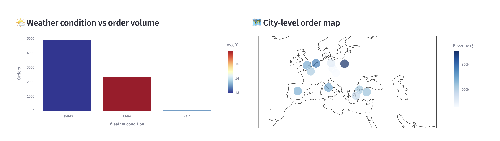
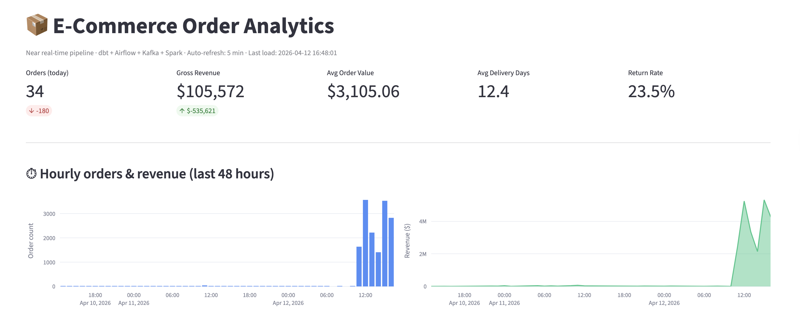
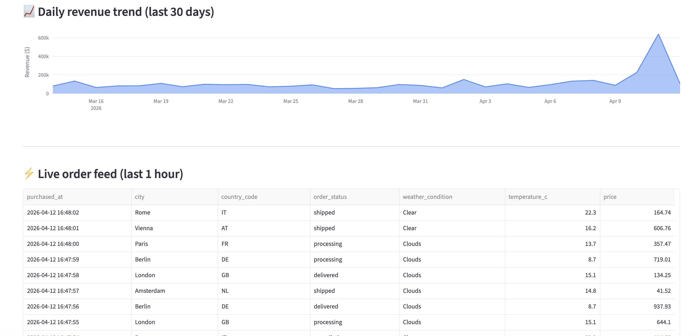
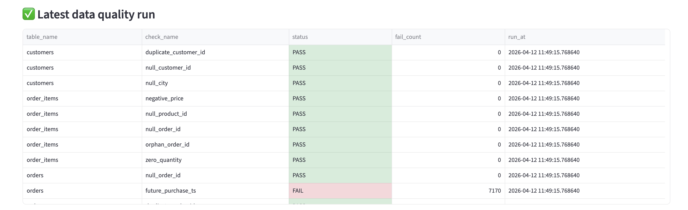

### Apache Airflow

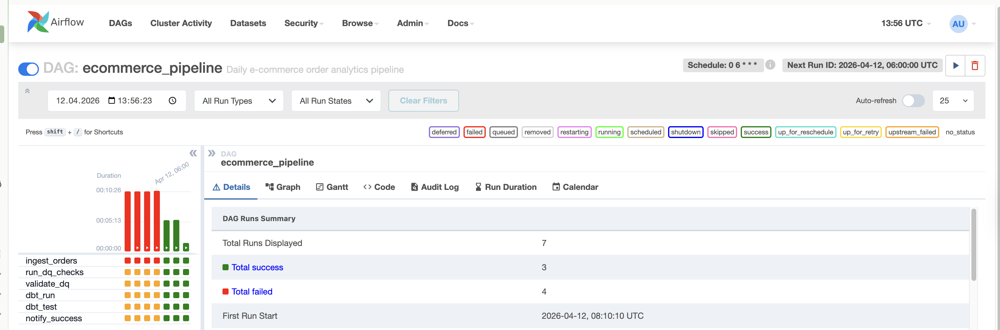
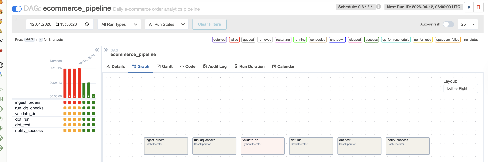

### Apache Kafka

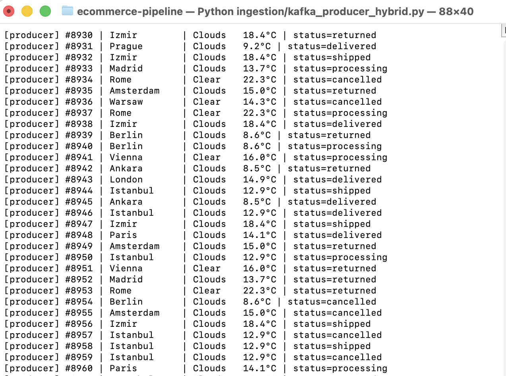
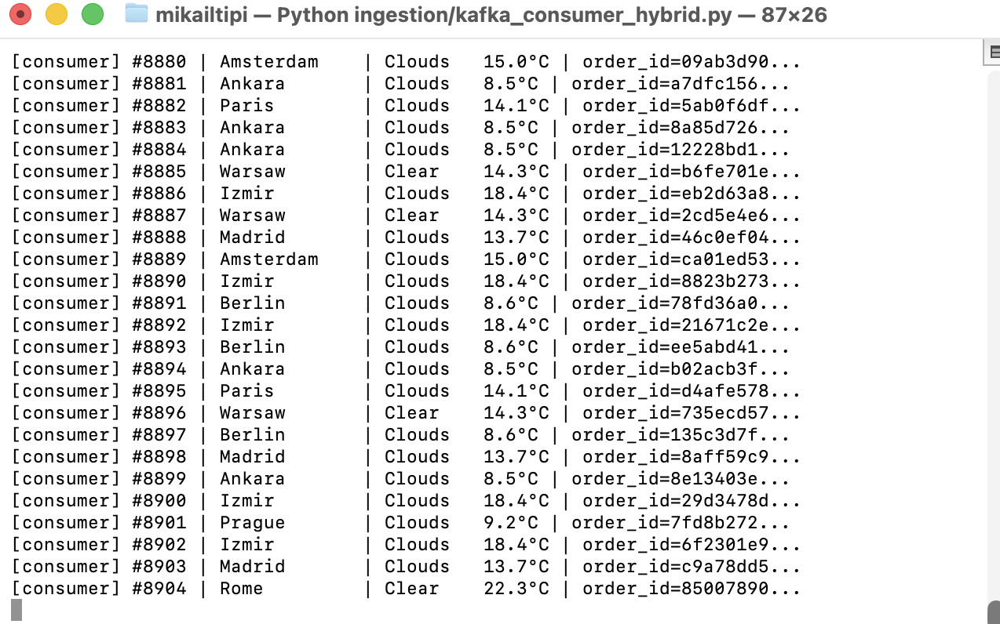

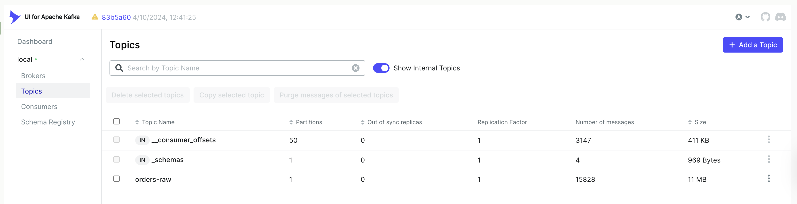
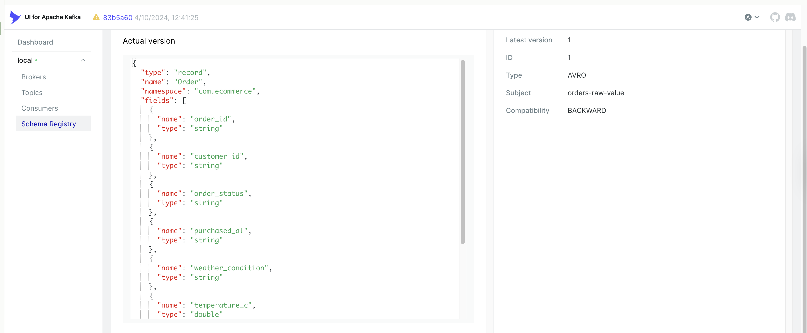

### Apache Spark

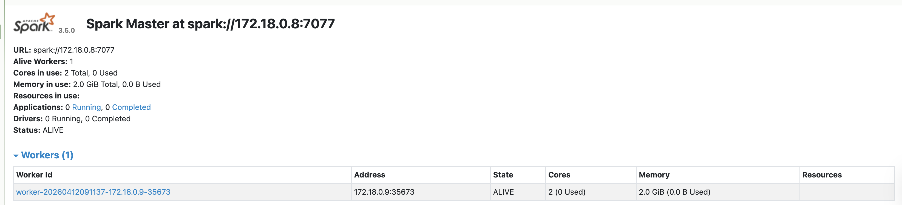

## Quick Start

### Prerequisites
- Docker Desktop
- Python 3.11+
- OpenWeatherMap API key (free at openweathermap.org)

### Run locally

```bash
# 1. Clone
git clone https://github.com/mikailtipi/near_real_time_ecommerce_project.git
cd near_real_time_ecommerce_project

# 2. Start core services
docker compose up -d postgres
sleep 15
docker compose up -d airflow-init
sleep 60
docker compose up -d airflow-webserver airflow-scheduler

# 3. Create virtual environment
python3.11 -m venv venv && source venv/bin/activate
pip install -r requirements.txt

# 4. Seed initial data
DB_HOST=localhost DB_PORT=5433 DB_USER=pipeline DB_PASSWORD=pipeline DB_NAME=ecommerce \
  python ingestion/generate_orders.py --mode seed

# 5. Start Kafka
docker compose up -d zookeeper kafka kafka-ui

# 6. Start streaming (3 terminals)
# Terminal 1 — producer
OPENWEATHER_API_KEY=your_key KAFKA_BOOTSTRAP=localhost:9092 \
  python ingestion/kafka_producer_hybrid.py

# Terminal 2 — consumer
DB_HOST=localhost DB_PORT=5433 DB_USER=pipeline DB_PASSWORD=pipeline DB_NAME=ecommerce \
  KAFKA_BOOTSTRAP=localhost:9092 python ingestion/kafka_consumer_hybrid.py

# Terminal 3 — dashboard
DB_HOST=localhost DB_PORT=5433 DB_USER=pipeline DB_PASSWORD=pipeline DB_NAME=ecommerce \
  streamlit run dashboard/app.py

# 7. Start Spark
docker compose up -d spark-master spark-worker

# 8. Run Spark job
DB_HOST=localhost DB_PORT=5433 DB_USER=pipeline DB_PASSWORD=pipeline DB_NAME=ecommerce \
  python spark/spark_metrics.py
```

### Service URLs

| Service | URL | Credentials |
|---|---|---|
| Streamlit Dashboard | http://localhost:8501 | — |
| Airflow UI | http://localhost:8080 | admin / admin |
| Kafka UI | http://localhost:8090 | — |
| Spark Master UI | http://localhost:8181 | — |
| PostgreSQL | localhost:5433 | pipeline / pipeline |

---

## Data Quality Checks

```bash
DB_HOST=localhost DB_PORT=5433 DB_USER=pipeline DB_PASSWORD=pipeline DB_NAME=ecommerce \
  python data_quality/dq_check.py
```

21 checks across 4 tables: null values, duplicate PKs, referential integrity, invalid enums, date logic violations, negative/zero numerics. Results saved to `raw.dq_results` for trend monitoring.

---

## What I Learned

- **Kafka offset management** — `auto_offset_reset="latest"` vs `"earliest"` significantly affects consumer behavior on restart
- **dbt schema routing** — Default schema prefix behavior requires a custom `generate_schema_name` macro to write to exact schema names
- **API caching strategy** — Caching weather data per-city for 5 minutes reduces API calls by ~98% while keeping data fresh enough for correlation analysis
- **Airflow task isolation** — Each task runs in its own subprocess; Python packages must be installed in the Airflow image, not just locally
- **DQ before transform** — Running data quality checks on raw data *before* dbt prevents silent bad data flowing into mart tables

---

## About

Built as a portfolio project to demonstrate end-to-end data engineering skills for EU-based roles.

Connect: [LinkedIn](https://linkedin.com/in/mikailtipi) · [GitHub](https://github.com/mikailtipi)
